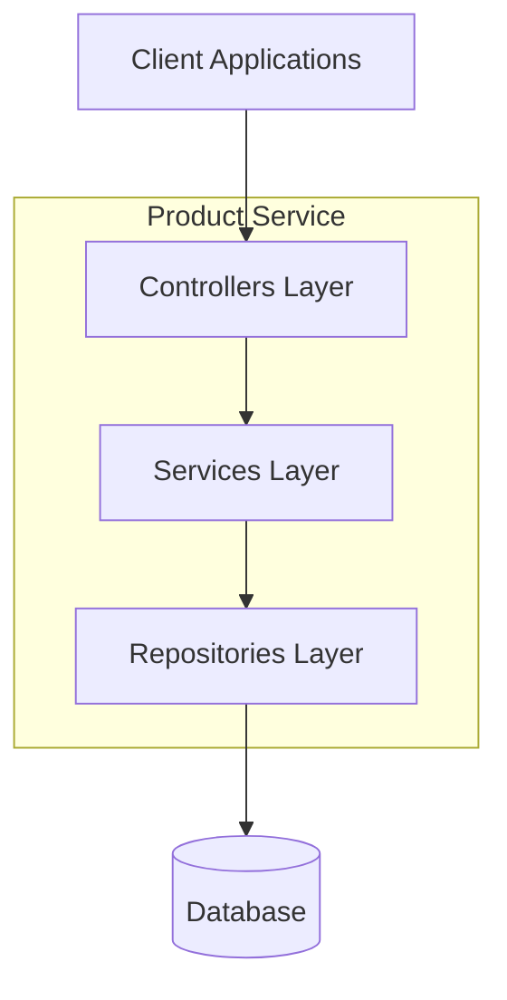

# ShopBridge - Product Service

This repository implements the **Product Service** of the ShopBridge system, designed as part of the **MVP project for the Advanced Back-End module of the Full-Stack Development postgraduate program at CCEC - PUC-Rio**. The service provides a fully functional API for managing products, enabling creation, retrieval, update, and deletion of product data in a microservices architecture.

Developed using **ASP.NET Core**, the service follows a layered architecture and adheres to industry best practices for RESTful APIs. It is designed to be integrated seamlessly into the system orchestration layer via Docker Compose.

---

## Repository Structure

```
shopbridge_product/
├── ProductApplication/                      # Main application project
│   ├── Controllers/                         # API controllers handling HTTP requests
│   ├── Data/                                # Database context and configuration
│   ├── Migrations/                          # EF Core database migrations
│   ├── Models/                              # Domain models and DTOs
│   ├── Properties/                          # Project metadata (e.g., launchSettings.json)
│   ├── Repositories/                        # Data persistence and database access
│   ├── Services/                            # Business logic and service layer
│   ├── ProductApplication.csproj            # Project definition
│   └── README.md                            # Project documentation
├── ProductApplication.Tests/               # Unit and integration tests
│   ├── Controllers/                         # Test cases for API controllers
│   ├── Repositories/                        # Test cases for data access layer
│   ├── Services/                            # Test cases for business logic
│   └── ProductApplication.Tests.csproj      # Test project definition
├── README.md                                # Root-level documentation
├── .gitignore                               # Git ignore rules
└── ProductApplication.sln                   # Solution file for the entire project
```

---

## Service Design Overview

The **Product Service** follows a layered architecture to ensure separation of concerns, scalability, and maintainability.

### Key Design Principles
- **Layered Architecture**: Controllers → Services → Repositories → Database
- **Domain-Driven Design (DDD) Lite**: Models and DTOs represent business entities clearly.
- **Persistence**: EF Core with SQLite for local development; easily swappable for other providers.
- **RESTful API**: Follows standard HTTP verbs and status codes.
- **Microservices Ready**: Designed to run independently and integrate via Docker networking.

### Design Decisions
- **Controllers** handle HTTP requests and delegate logic to services.  
- **Services** encapsulate business rules and orchestrate data flow.  
- **Repositories** abstract persistence, making the service database-agnostic.  
- **Migrations** ensure schema evolution is tracked and reproducible.  
- **Tests** validate each layer independently (unit + integration).  


## Service Architecture Overview

<p align="center">



</p>

---

## Getting Started

### 1. Clone the repository
```bash
git clone https://github.com/mattsimoessilva/shopbridge_product.git
cd shopbridge_product
cd ProductApplication
```

### 2. Run the service
You can run the service locally via Docker Compose (from the orchestration repository) or directly using `dotnet run`:

```bash
dotnet run --project ProductApplication.csproj
```

The API will be available at **http://localhost:5001**.

---

## Managing the Database

The service uses **Entity Framework Core (EF Core)** with **SQLite** for persistence.  
Below is a catalog of the most common commands you’ll need when working with the database.

### Add a new migration
Creates a new migration file to track schema changes.
```bash
dotnet ef migrations add MigrationName 
```

### Apply migrations
Applies all pending migrations to the database.
```bash
dotnet ef database update
```

### Remove the last migration
Rolls back the last migration (only if it hasn’t been applied to the database yet).
```bash
dotnet ef migrations remove
```

### Reset the database
Drops the database and recreates it with the latest migrations.
```bash
dotnet ef database drop
dotnet ef database update
```

---

## Running Unit Tests

Unit and integration tests are located in the **ProductApplication.Tests** project.  
Below is a catalog of the most common commands for running and filtering tests.

### Run all tests
Executes the entire test suite.
```bash
dotnet test
```

### Run tests with detailed output
Provides verbose output for better debugging and visibility.
```bash
dotnet test -v n
```

### Run a specific test class
Runs only the tests within a specific class.
```bash
dotnet test --filter FullyQualifiedName~Namespace.ClassName
```

### Run a specific test method
Runs a single test method within a class.
```bash
dotnet test --filter FullyQualifiedName~Namespace.ClassName.MethodName
```

---

## API Endpoints

### Products

| Method | Endpoint                        | Description                                |
|--------|---------------------------------|--------------------------------------------|
| POST   | `/api/products`                 | Creates a new record                       |
| GET    | `/api/products`                 | Retrieves all records                      |
| GET    | `/api/products/{id}`            | Retrieves a specific record by ID          |
| PUT    | `/api/products`                 | Updates an existing record                 |
| DELETE | `/api/products/{id}`            | Deletes a record by ID                     |
| POST   | `/api/products/{id}/reserve`    | Reserves stock                             |
| POST   | `/api/products/{id}/release`    | Releases previously reserved stock         |
| PATCH  | `/api/products/{id}/quantity`   | Reduces stock permanently                  |

---

### Product Reviews

| Method | Endpoint                          | Description                                |
|--------|-----------------------------------|--------------------------------------------|
| POST   | `/api/product-reviews`            | Creates a new record                       |
| GET    | `/api/product-reviews`            | Retrieves all records                      |
| GET    | `/api/product-reviews/{id}`       | Retrieves a specific record by ID          |
| PUT    | `/api/product-reviews`            | Updates an existing record                 |
| DELETE | `/api/product-reviews/{id}`       | Deletes a record by ID                     |

---

### Product Variants

| Method | Endpoint                              | Description                                |
|--------|---------------------------------------|--------------------------------------------|
| POST   | `/api/product-variants`               | Creates a new record                       |
| GET    | `/api/product-variants`               | Retrieves all records                      |
| GET    | `/api/product-variants/{id}`          | Retrieves a specific record by ID          |
| PUT    | `/api/product-variants`               | Updates an existing record                 |
| DELETE | `/api/product-variants/{id}`          | Deletes a record by ID                     |
| POST   | `/api/product-variants/{id}/reserve`  | Reserves stock                             |
| POST   | `/api/product-variants/{id}/release`  | Releases previously reserved stock         |
| PATCH  | `/api/product-variants/{id}/quantity` | Reduces stock permanently                  |
         |

All endpoints follow REST conventions and return appropriate HTTP status codes (200, 201, 204, 400, 404, 500) with JSON payloads.

---

## Notes

- The service uses **SQLite** for local persistence.  
- It is designed to operate as part of the **ShopBridge microservices system**, communicating with other services via internal Docker networking.  
- All timestamps are in ISO 8601 format, and UUIDs are used for unique identification of records.

---

## References

[1] S. Newman, *Building Microservices: Designing Fine-Grained Systems*. O’Reilly Media, 2015.  
[2] Microsoft, *ASP.NET Core Documentation*, 2025. Available: https://docs.microsoft.com/aspnet/core.
